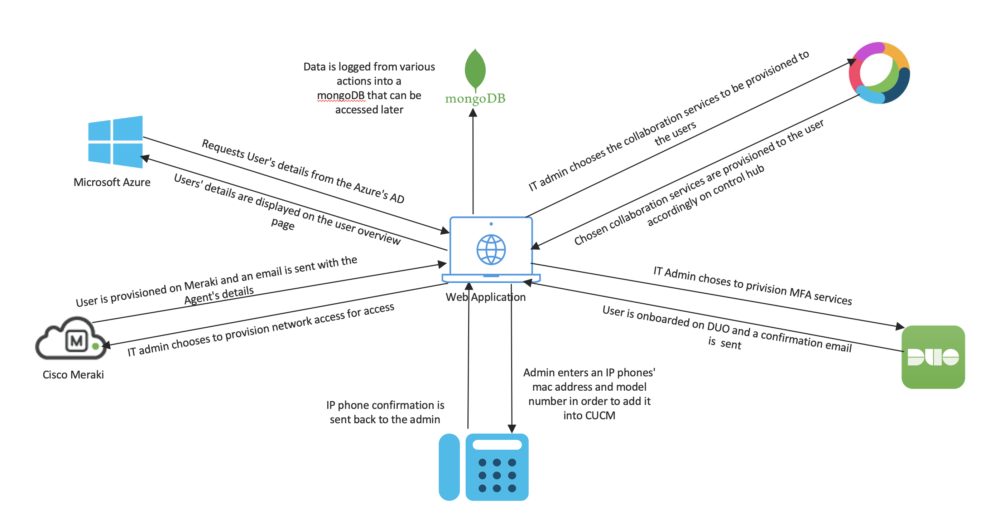
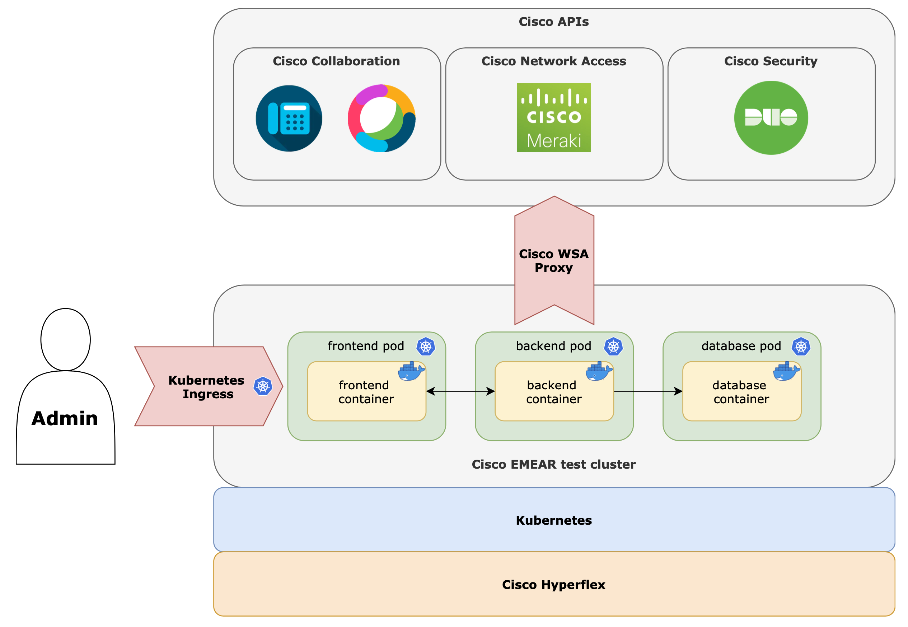
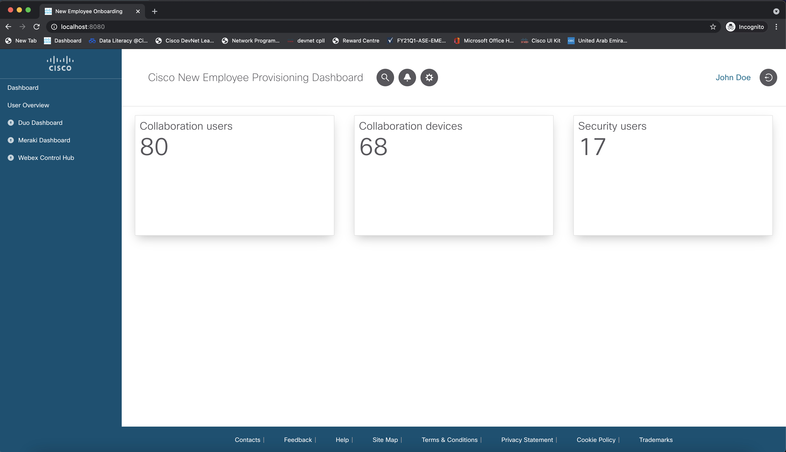
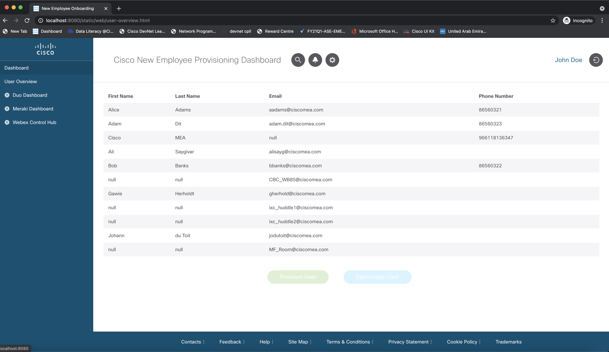
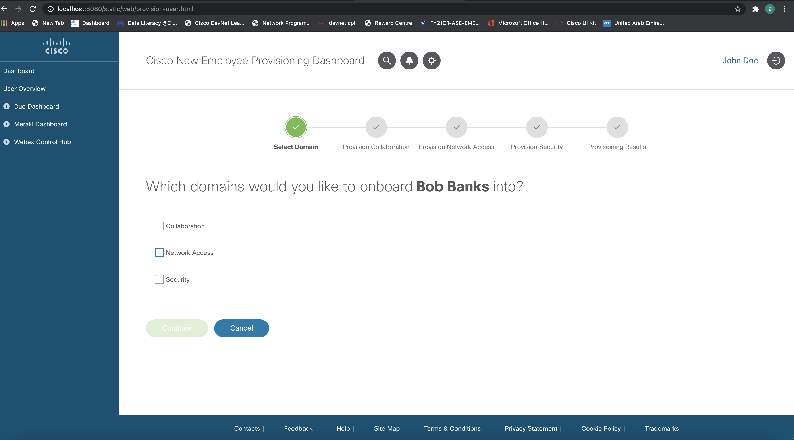
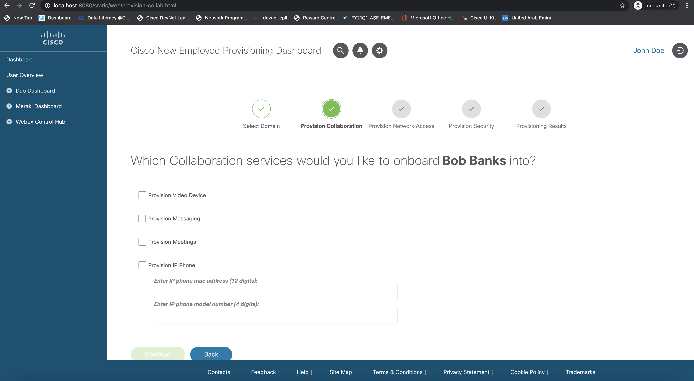
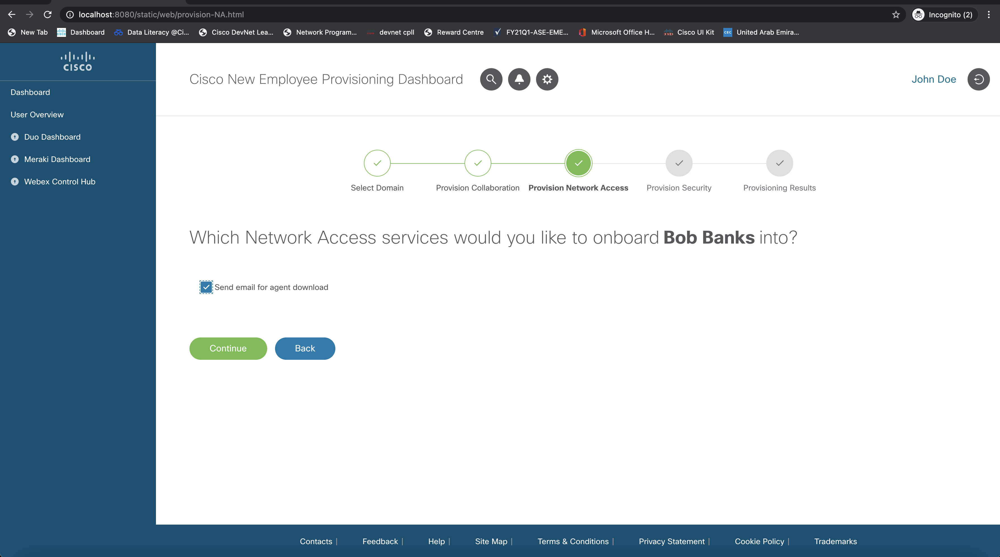
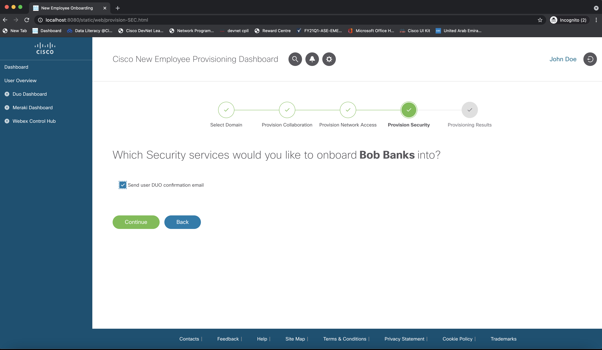
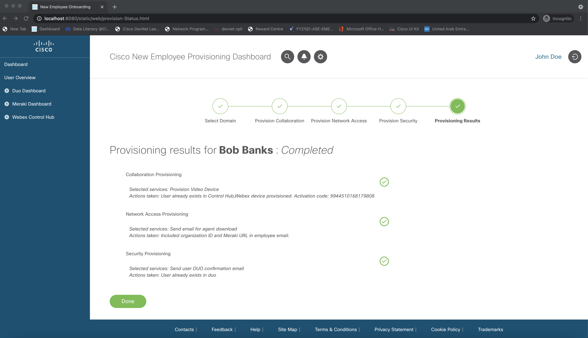
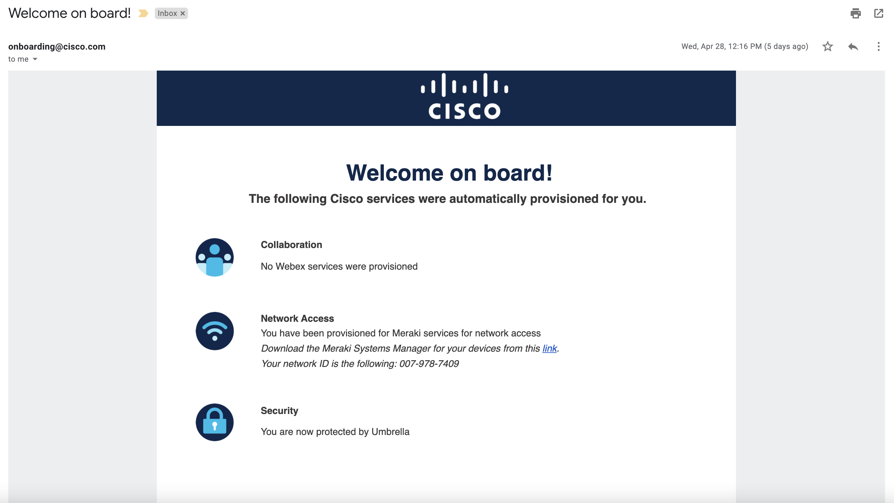

# New Employee Onboarding

*This project holds the codebase for a Cisco-internal sofware project delivered by a CSAP FY21 team.* 

This **New Employee Onboarding** application offers a unified dashboard for administrators to onboard new employees onto different Cisco technologies. The dashboard is connected to Azure Active Directory to automatically retrieve user information, upon which administrators can use an intuitive user interface for selecting the employee to be onboarded, and the specific products to be provisioned. The dashboard then uses APIs to interact with the desired Cisco products for automatic provisioning, finally alerting the administrator of (un)successful employee onboarding.

A video showing a sample run of this prototype is linked [here](https://youtu.be/INGnD_586jw).

## Contacts
* Mohamed El Refaay (moelrefa@cisco.com)
* Stien Vanderhallen (stienvan@cisco.com)
* Zaid Al Taher (zaltaher@cisco.com)
* Abdulmajed Almodhabri (aalmodha@cisco.com)

## Solution Components 
* **Backend/delivery technologies**
  * Python
  * Docker, Docker Compose
  * Kubernetes
  * MongoDB
* **Cisco APIs** for automatic provisioning
  * Webex
  * CUCM
  * Duo
  * Cisco Meraki
* **Azure Active Directory** for user information retrieval

## Overview



## Deployment
[Link to public deployment](https://emear-apps-test.cisco.com/employee-onboarding/)



## Installation Guide
1. Install Docker Desktop

    https://www.docker.com/products/docker-desktop

2. Install Docker Compose

```
$ pip install docker-compose
```

3. Clone repository

```
$ git clone https://wwwin-github.cisco.com/gve/gve_devnet_new_employee_onboarding.git
$ cd new-employee-onboarding
```
4. Set up environment
    1. Create a Webex integration + bot [here](https://developer.webex.com/)
    2. Create an Azure AD application
    3. Set corresponding environment variables in `docker-compose.yml`

5. Build application

```
$ docker-compose down
$ docker-compose build
$ docker-compose up -d
```

6. Navigate to `localhost:8080`

## Usage
- **Dashboard landing page** ( `Dashboard` ): Lists the number of users enrolled in the connected Webex deployment, the number of devices enrolled in the connected Webex deployment, and the number of users enrolled in the connected Duo deployment.



- **User Overview page** ( `Dashboard > User Overview` ): Lists the users as retrieved from Azure Active Directory, and their respective information.



- **Domain Selection page** ( `Dashboard > User Overview > Provision User` ): Allows the administrator to select the Cisco service domains to be provisioned for the currently selected user. The administrator can select Collaboration (Webex, CUCM), Network Access (Meraki) and/or Security (Duo).



- **Collaboration page** ( `Dashboard > User Overview > Provision User` ): Allows the administrator to select the collaboration licenses to be provisioned for the currently selected user. The administrator can select Messaging (Webex), Meetings (Webex), a video device (Webex) and/or an IP phone (CUCM).



- **Network Access page** ( `Dashboard > User Overview > Provision User` ): Allows the administrator to select the network access services to be provisioned for the currently selected user. The administrator can select to send an email to the selected employee listing the information needed to connect to Meraki. The e-mail address used is as retrieved from Azure Active Directory.



- **Security page** ( `Dashboard > User Overview > Provision User` ): Allows the administrator to select the security services to be provisioned for the currently selected user. The administrator can select to send an email to the selected employee listing the information needed to connect to Duo. The e-mail address used is as retrieved from Azure Active Directory.



- **Status page** ( `Dashboard > User Overview > Provision User > Done` ): Lists the outcome for the provisioning of each selected services, as well as a list of actions taken. At this point, an onboading e-mail holding comprehensive onboarding information is sent to the selected employee, using its e-mail address as retrieved from Azure Active Directory.



- **Employee email**: The onboading e-mail holding comprehensive onboarding information that is sent to the selected employee, using its e-mail address as retrieved from Azure Active Directory.



### LICENSE

Provided under Cisco Sample Code License, for details see [LICENSE](LICENSE.md)

### CODE_OF_CONDUCT

Our code of conduct is available [here](CODE_OF_CONDUCT.md)

### CONTRIBUTING

See our contributing guidelines [here](CONTRIBUTING.md)

#### DISCLAIMER:
<b>Please note:</b> This script is meant for demo purposes only. All tools/ scripts in this repo are released for use "AS IS" without any warranties of any kind, including, but not limited to their installation, use, or performance. Any use of these scripts and tools is at your own risk. There is no guarantee that they have been through thorough testing in a comparable environment and we are not responsible for any damage or data loss incurred with their use.
You are responsible for reviewing and testing any scripts you run thoroughly before use in any non-testing environment.
